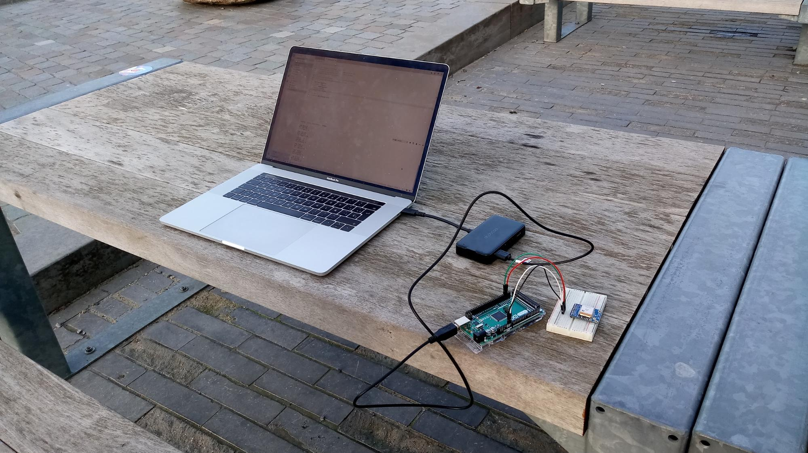
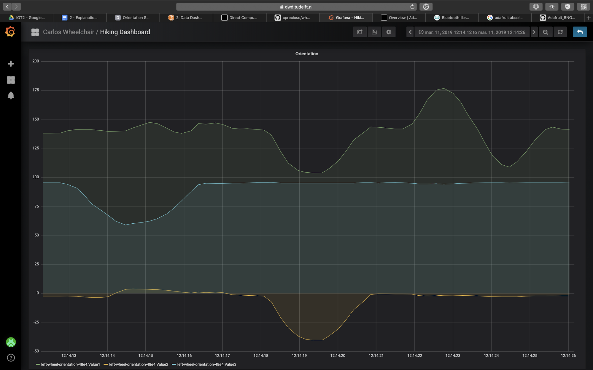

We used the Adafruit GPS Library example to just test the sensor, along with the example wiring in [Adafruit’s documentation](https://learn.adafruit.com/adafruit-ultimate-gps/direct-computer-wiring). However while the sensor seems to work, it doesn’t get a “fix” (it can’t get a signal from any satellite). We left the building to check in a less crowded area but it didn’t seem to get a signal from not even one satellite.

Therefore, we made the decision to instead set up the orientation sensor, and detect the inclination of our wheelchair. This is important to detect any accidental fall of the person using the wheelchair. We used [the example code in the Workshop 2](https://datacentricdesign.github.io/wheelchair-design-platform/workshops/Workshop2) to process it and send it to Grafana.

---

The result is as follows:

[Video](https://drive.google.com/file/d/1aljbPXR16YAgsIGvj2omWFvFmEBymUW_/view)

We thought that the data shown was not correct since we had similar trends for different values. After a research, we realised we had to calibrate our sensor everytime we would want to retrieve data. Moreover, we were not getting the processed Euler angles, but the quaternion data.

Therefore, we introduced [a piece of code](https://github.com/cprecioso/wheelchair-design-platform/commit/b26b7e2124c6a8c7d292569fcbb0753fd8578a4a) taken to make sure that the data was retrieved only if gyroscope and motion sensors were calibrated, and used the facilities provided by the Adafruit Unified Sensor Interface to retrieve the Euler angles.

---

In the end, these are our results:

This data was collected by changing the inclination of the wheelchair in different directions as shown in the following [video](https://drive.google.com/file/d/1895N6_ur4FELVJ0WFj4_osIflL6UGn5T/view). The sensor is positioned behind the left wheel. We’re not interested in the rotation of the wheel but in the angle of the whole wheelchair compared to every axis of rotation.

The graph shows:

| Name    | Color  | Rotation axis |
| ------- | ------ | ------------- |
| Value 1 | Green  | `z`           |
| Value 2 | Orange | `y`           |
| Value 3 | Blue   | `x`           |
