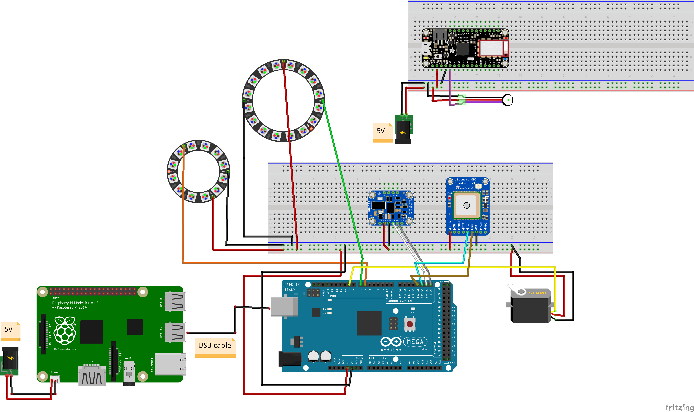

# Internal architecture

The Naturely system is composed of 3 main devices that communicate between them and their peripherals:

## [Arduino Mega](../code/mega/README.md)

The Mega is the main sensor/actuator hub. It's connected to the majority of the peripherals. However, it has no decision power, and just feeds information through the Serial port and reacts to the commands that arrive. The Serial port and power are transported through the USB port. Check the [README of its code](../code/mega/README.md) for more in-depth knowledge.

## [Adafruit Feather 32u4](../code/feather/README.md)

This is the least powerful device. It's designed to be more mobile in character than the Mega, so it is ideal for the Heart Rate sensor, as it should be passenger-mounted. This is the only peripheral attached to it, save for a small battery. It provides a Bluetooth characteristic which reads the current value of the sensor. Check the [README of its code](../code/feather/README.md) for more in-depth knowledge.

## [Raspberry Pi Model 3B](../code/raspberry/README.md)

The central hub. It connects to the Feather and Mega, reads their sensor data, makes decisions based on their input, and sends back commands to respond to them; as well as uploading this real-time data to the DCD Hub. It is fed power from a battery. It conects to the Mega through the USB port, to the Feather through Bluetooth, and to the DCD Hub through Wi-Fi. Check the [README of its code](../code/raspberry/README.md) for more in-depth knowledge.
