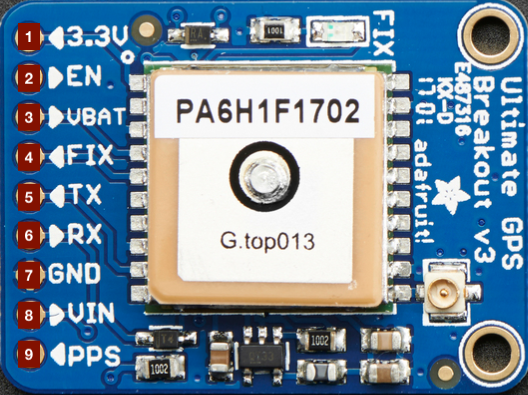

# GPS Positional Sensors
GPS (Global Positioning System) is a global satellite-based radio navigation system, composed of a satellite system that provides geolocation and time information to a GPS receiver anywhere on or near the Earth where there is an unobstructed line of sight to four or more GPS satellites. These signals are relatively weak, and obstacles such as Buildings or mountains can block them.

GPS does not require the user to transmit any data, and it operates independently of any telephonic or internet reception, though these technologies can enhance the usefulness of the GPS positioning information.

## Adafruit Ultimate GPS Breakout v3

This breakout is built around the MTK3339 chipset, a high-quality GPS module that can track up to 22 satellites on 66 channels, has an high-sensitivity receiver (-165 dBm tracking), and a built-in antenna. It can do up to 10 location updates a second for high speed, high sensitivity logging or tracking. Power usage is low, at around 20mA during navigation.

### Pins
1. **3.3v** - Clean 3.3V output from internal voltage regulator, supplies at least 100mA, if needed;
2. **EN** -  Enable pin, has a 10K pull up resistor. When this pin is pulled to ground, it will turn off the GPS module. Handy for very low power projects where you want to easily turn the module off for long periods. You will lose your fix if you disable the GPS and it will also take a long time to get fix back if you don't have the backup battery installed;
3. **VBAT** - Input pin, connected to the GPS real time clock battery backup. Using the battery spot on the back is suggested, but if you have a project with a coin cell or another kind of battery that you want to use (and its under 3.3V) you can connect it to the VBAT pin;
4. **FIX** - Output pin, same pin as the one that drives the red LED. When there is no fix, the FIX pin pulses up and down once every second. When there is a fix, the pin is low (0V) for most of the time, and once every 15 seconds it will pulse high for 200 milliseconds;
5. **TX** - Serial data pin, that transmits data from the GPS module to your microcontroller/computer. It uses 3.3V logic levels. Data comes out at 9600 baud by default;
6. **RX** - Serial data pin used to send data to the GPS. Can be used with 3.3V or 5V logic, there is a logic level shifter. By default it expects 9600 baud data, which has to be sent to it checksum'med with NMEA (combined electrical and data specification for communication between marine electronics such as echo sounder, sonars, anemometer, gyrocompass, autopilot, GPS receivers a) sentences;
7. **Gnd** - common power and signal ground;
8. **Vin** - Power input, to be connected to 3-5VDC. GPS's are very sensitive, so is important to have a nice and quiet power supply. Don't connect to a switching supply if you can avoid it, also, an LDO (Low-dropout regulator) will be less noisy;
9. **PPS** - Output pin. It is a "pulse per second" type of output. Most of the time it is at logic low (ground) and then it pulses high (3.3V) once a second, for 50-100ms, so it should be easy for a microcontroller to sync up to it.
